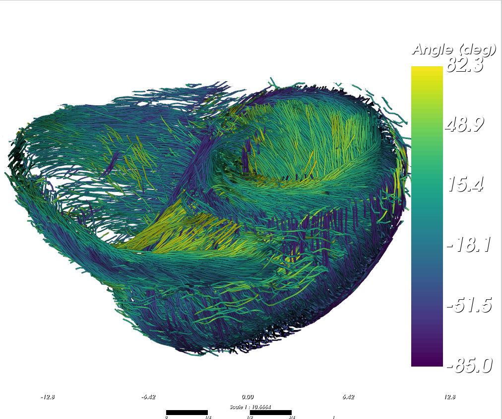

# Streamlines

Use this page to generate and inspect 3D streamlines with:

- `cardio-generate-streamlines`
- `cardio-visualize-streamlines`

## Before You Start

- In the config file, set `WRITE_VECTORS = True` and `TEST = False`.
- Run `cardio-tensor` on your full dataset.
- Make sure these outputs exist in `OUTPUT_PATH`:
    - `eigen_vec/`
    - `FA/`
    - angle folders (`HA`/`IA` or `AZ`/`EL`, depending on `ANGLE_MODE`)

!!! note

    It is useful to provide a `MASK_PATH` to avoid placing seeds and tracing streamline outside the sample, even though the FA threshold should avoid this.


## Generate Streamlines

Basic example:

```console
$ cardio-generate-streamlines ./parameters_example.conf
```

Useful options:

- `--seeds`: number of seeds (default: 20000).
- `--fa-seed-min`: minimum FA to place seeds (default: 0.2).
- `--fa-threshold`: minimum FA to continue tracking (default: 0.1).
- `--angle`: maximum turning angle (degrees - default: 60.0).
- `--step`: integration step length (voxels - default: 0.5).
- `--min-len`: minimum streamline length (points - default: 10).
- `--bin`: downsampling factor for faster processing.
- `--start-z/--end-z` (and `x`, `y` variants): process only a sub-volume.

Generated files:

- `OUTPUT_PATH/streamlines.trk`


!!! note

    Use `--bin` if the dataset is too big to fit in RAM. This will bin the eigenvectors and the maps.

## Cluster Streamlines

Use decreasing thresholds to run hierarchical QuickBundlesX:

```console
$ cardio-analysis-streamlines OUTPUT_PATH/streamlines.trk \
    --quickbundles 5 2 1 \
    --cluster-max-streamlines 50000 \
    --cluster-min-size 10 \
    --max-clusters 100 \
    --outdir streamline_analysis
```

The thresholds use the physical coordinate unit stored in the TRK. New
CardioTensor tractograms store millimetres. A single threshold runs
QuickBundles; multiple decreasing thresholds run QuickBundlesX.

For a legacy TRK stored in voxel coordinates, scale it to millimetres during
analysis. For example, use the following for 16.495 µm voxels:

```console
$ cardio-analysis-streamlines streamlines.trk --voxel-size 0.016495 \
    --quickbundles 5 2 1 --outdir streamline_analysis
```

The command writes:

- `*_quickbundles_clusters.csv`: cluster sizes and centroid lengths.
- `*_quickbundles_centroids.trk`: one representative centroid per cluster.
- `*_quickbundles_members.trk`: every sampled full-resolution streamline from
  the retained clusters, colored through its stored `cluster_id` field.
- `*_quickbundles_membership.npz`: sampled source-streamline indices and their
  cluster identifiers.

`--cluster-min-size` first removes small clusters from the centroid and member
TRK files. `--max-clusters 100` then keeps only the 100 largest surviving
clusters in those TRKs. The CSV still contains every cluster, with
`saved_centroid` indicating which representatives were written, and the
membership NPZ retains every sampled assignment.

Visualize the representative trajectories with:

```console
$ cardio-visualize-streamlines *_quickbundles_centroids.trk --color-by cluster_id
```

Visualize all sampled members of the retained clusters with:

```console
$ cardio-visualize-streamlines *_quickbundles_members.trk \
    --color-by cluster_id --top-clusters 100 --subsample 5
```

`--top-clusters N` keeps every streamline belonging to the N largest stored
clusters. It is a display-only filter and does not rerun or modify clustering.

The member TRK is written through a second sequential input pass so the
full-resolution trajectories do not all need to be copied into RAM.

By default, clustering uses a reproducible reservoir sample of at most 50,000
streamlines to keep memory bounded. Use `--cluster-max-streamlines 0` only when
the complete tractogram comfortably fits in memory.

## Compare Multiple Hearts

Passing two or more tractograms automatically creates a cohort report. Use the
same tracking, filtering, physical coordinate unit, and QuickBundles thresholds
for every heart:

```console
$ cardio-analysis-streamlines heart1.trk heart2.trk heart3.trk heart4.trk \
    --labels H1 H2 H3 H4 \
    --min-points 250 \
    --quickbundles 20 10 \
    --cluster-points 30 \
    --cluster-max-streamlines 100000 \
    --cluster-min-size 10 \
    --max-clusters 100 \
    --outdir cohort_analysis
```

In addition to the per-metric and per-heart clustering files, this writes:

- `heart_summary.csv`: one row per heart containing streamline counts, spatial
  extent, and the mean, median, quartiles, and IQR of length, normalized length,
  curvature, and tortuosity. When clustering is enabled it also contains cluster
  count, top-10 coverage, entropy, normalized entropy, and effective number of
  clusters.
- `geometry_distributions.png/.pdf`: three ECDF panels for normalized length,
  mean curvature, and tortuosity.
- `heart_metric_summary.png/.pdf`: median and IQR for each heart.
- `heart_distance_matrix.csv` and `heart_distance_heatmap.png/.pdf`: a
  symmetric heart-to-heart distance based on the three geometry distributions.
- `cluster_rank_abundance.png/.pdf`: cluster abundance and cumulative cluster
  coverage. This file is created when `--quickbundles` is used.

Streamline analysis does not create large system-temporary files. QuickBundles
outputs and report figures are written directly to `--outdir`; use an absolute
path on the data-processing filesystem when launching from another directory.
If an analysis reads an unusual single-file TIFF that needs a fallback memmap,
the file uses `.cardiotensor_scratch` beside that TIFF instead of system
`/tmp`.

Normalized length is streamline length divided by the tractogram bounding-box
diagonal. The distance heatmap averages the one-dimensional Wasserstein distance
for the three metrics after dividing each by its pooled IQR. A value of zero
means identical sampled distributions; larger values indicate greater
differences.

Distribution plots and distances use the same reproducible sample size for
every heart: at most 20,000 streamlines, or the size of the smallest eligible
tractogram. Heart-level summary statistics use all eligible streamlines. The
heart remains the biological replicate; individual streamlines should not be
reported as independent samples.

## Visualize Streamlines

```console
$ cardio-visualize-streamlines ./parameters_example.conf --downsample 5
```

Useful options:

- `--color-by`: `auto`, `elevation`, or stored fields like `HA`, `IA`, `AZ`, `EL`.
- `--list-color-by`: list available fields in the `.trk`.
- `--line-width`: tube width.
- `--subsample`: keep every Nth streamline.
- `--min-length`: filter short streamlines.
- `--crop-x`, `--crop-y`, `--crop-z`: spatial crop ranges.
- `--screenshot`: save a PNG snapshot.
- `--video`: save an orbit video. FURY frame files use
  `.cardiotensor_scratch` beside the video rather than system `/tmp`, and are
  removed after successful encoding.

!!! note

    Use `--downsample` to keep fewer points per streamline and improve rendering performance on large datasets.

<figure markdown="span">
{ width="75%" }
<figcaption>Example 3D streamline rendering in a human heart.</figcaption>
</figure>

The dataset used as an example here can be find at [DOI](https://doi.org/10.15151/esrf-dc-1634390196)


## Keybindings

In the interactive viewer:

- `O`: toggle clipping plane on/off.
- `H`: show/hide clipping plane gizmo.
- `I`: flip clipping plane normal.
- `R`: reset clipping plane to center.
- `+` / `-`: increase/decrease streamline thickness.
- `B`: toggle background color (black/white).
- `S`: show/hide scale bar.
- `P`: save a high-resolution PNG snapshot.

!!! Note

    During interaction (rotate/pan/zoom), the viewer switches to a low-resolution for better responsiveness, then automatically returns to full resolution when interaction ends.

<figure markdown="span">
{ width="75%" }
<figcaption>Example 3D streamline rendering in a human heart, cropped using the clipping plane.</figcaption>
</figure>


## Quick Tuning Workflow

1. Start with `--seeds 10000`.
2. Check global coverage and continuity.
3. Increase `--seeds` if regions are undersampled.
4. Increase `--fa-threshold` or decrease `--angle` to reduce implausible curves.
5. Use `--subsample` and `--downsample` for faster visual inspection.

!!! warning

    Interpretation depends strongly on tracking parameters. Compare conditions only when parameters, such as seeding and thresholds, are similar.

